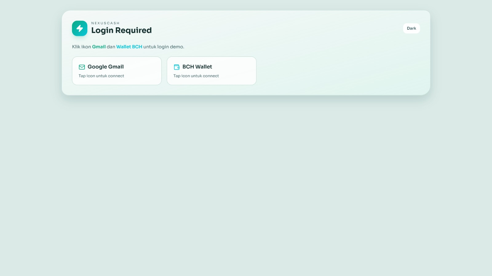
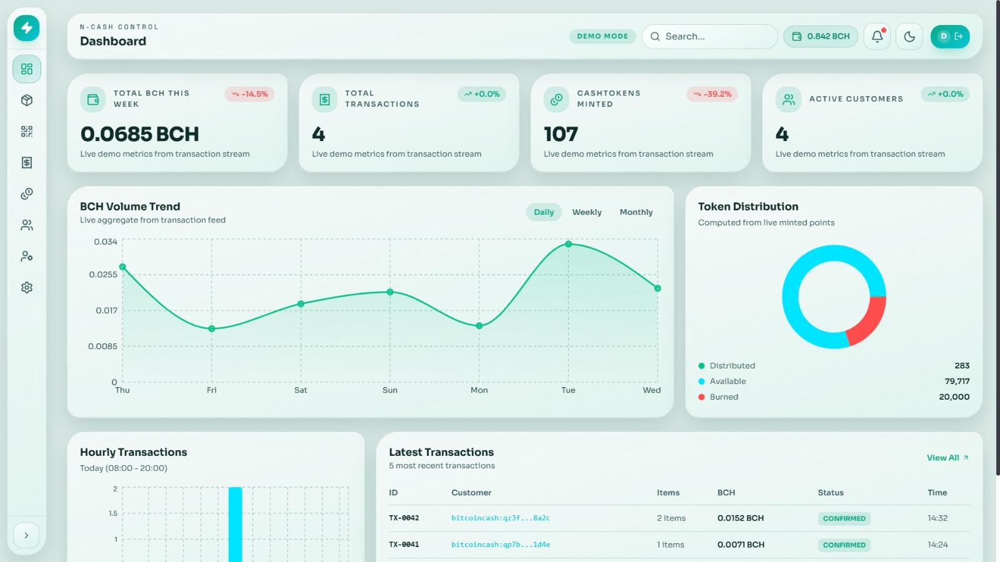
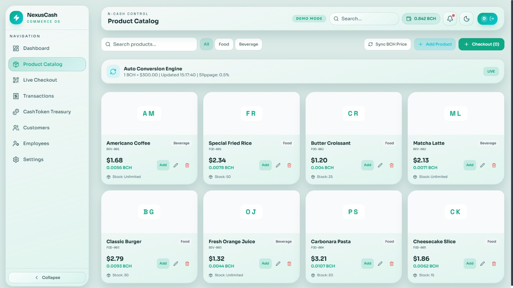
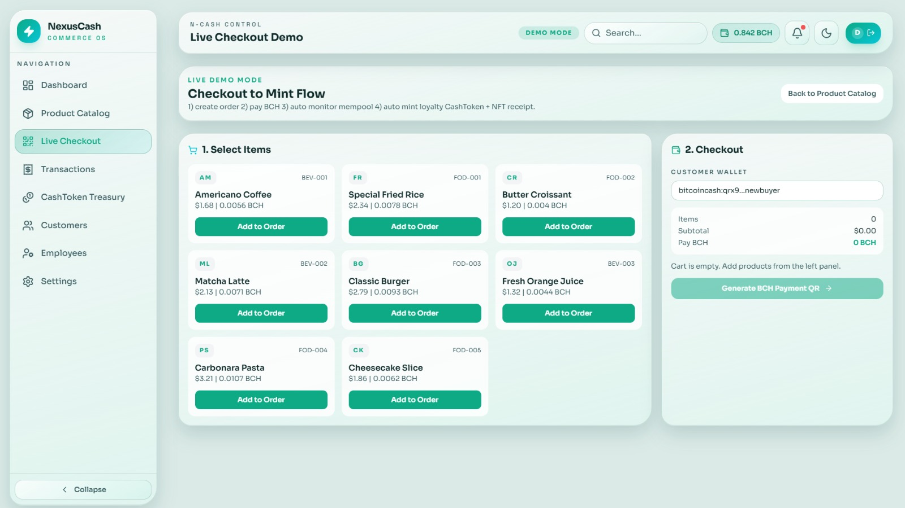
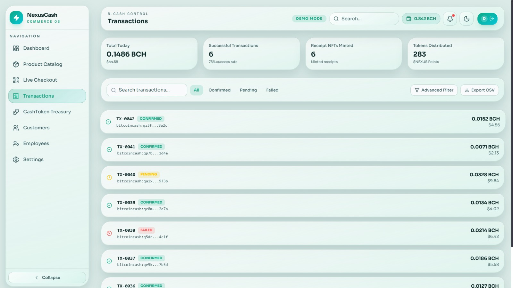
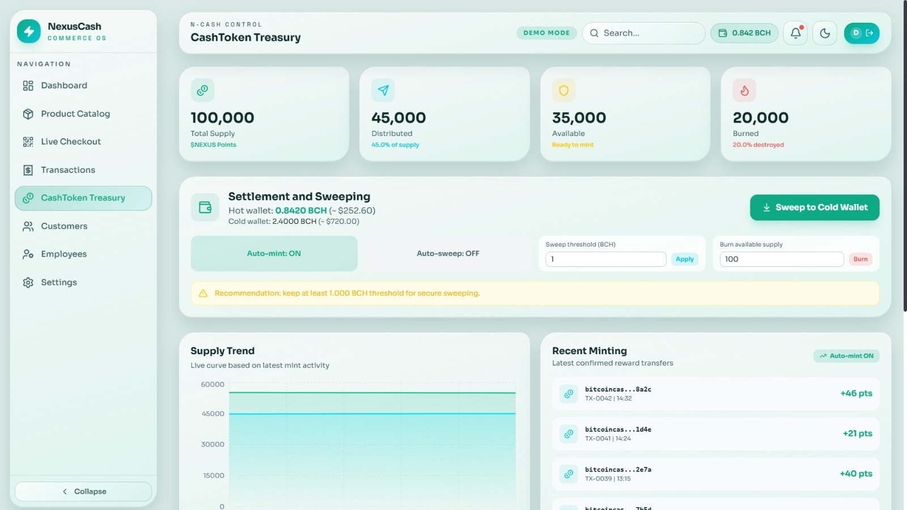
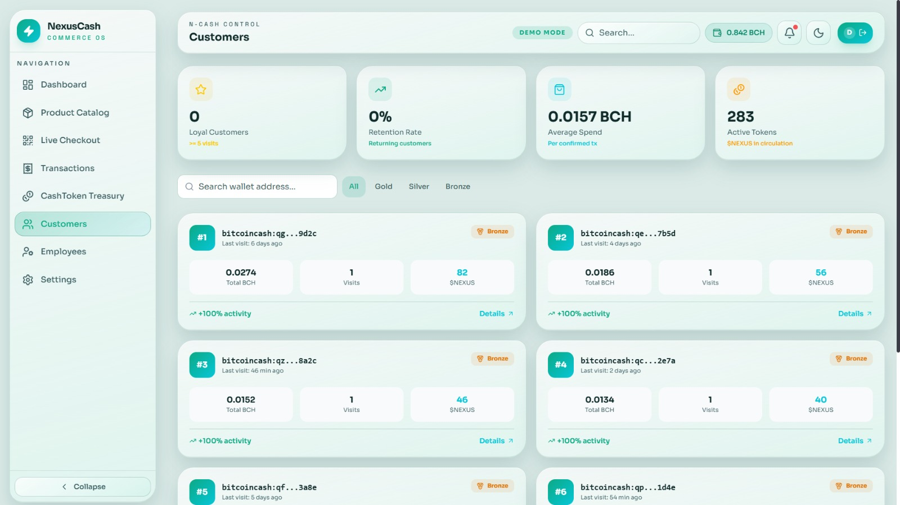
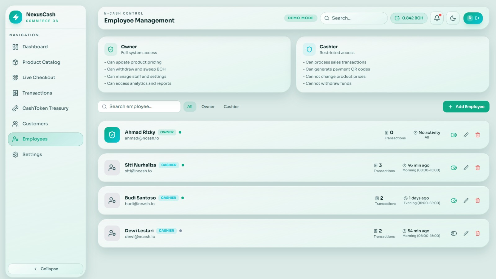
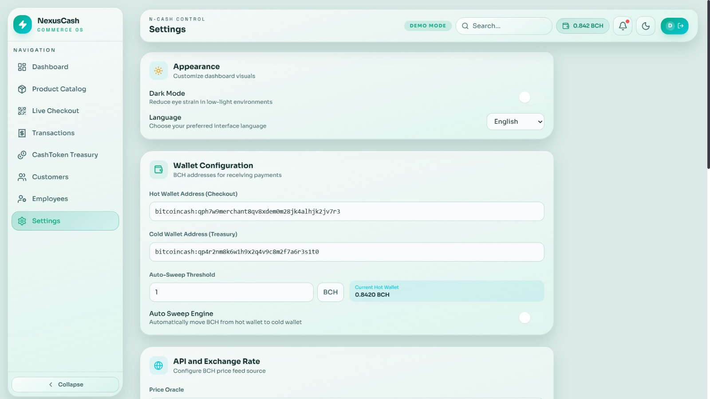

# ⚡ NexusCash POS — Bitcoin Cash Point of Sale System

> 🏆 Built for [BCH-1 Hackcelerator](https://dorahacks.io/hackathon/bch-1-hackcelerator) — Applications Track

**NexusCash POS** is a modern Point of Sale system built on **Bitcoin Cash (BCH) + CashTokens** for F&B and retail merchants. It enables real-time BCH payments, on-chain loyalty rewards, digital NFT receipts, and full operational analytics — all in one unified commerce operating system.

🌐 **Live Demo**: [nexus-cash.vercel.app](https://nexus-cash.vercel.app)  
📦 **Repository**: [github.com/panzauto46-bot/NEXUS-CASH](https://github.com/panzauto46-bot/NEXUS-CASH)

---

## 📸 Screenshots

### Login & Authentication
<p align="center">
  
</p>
<p align="center"><em>Connect with Gmail + BCH Wallet to access the POS system</em></p>

### Dashboard & Analytics
<p align="center">
  
</p>
<p align="center"><em>Real-time revenue metrics, trend charts, and transaction overview</em></p>

### Product Catalog & Checkout
<p align="center">
  
</p>
<p align="center"><em>Full product management with category filters and cart integration</em></p>

<p align="center">
  
</p>
<p align="center"><em>BCH payment flow: QR code → Broadcast → Confirmation → Mint rewards</em></p>

### Transactions & Treasury
<p align="center">
  
</p>
<p align="center"><em>Complete transaction history with advanced filters and CSV export</em></p>

<p align="center">
  
</p>
<p align="center"><em>$NEXUS token treasury: supply management, sweep, burn, and mint controls</em></p>

### Customers & Employees
<p align="center">
  
</p>
<p align="center"><em>Customer analytics with Gold/Silver/Bronze tier system</em></p>

<p align="center">
  
</p>
<p align="center"><em>Employee management with roles, shifts, and status controls</em></p>

### Settings
<p align="center">
  
</p>
<p align="center"><em>18+ configurable options: wallets, pricing, tokens, notifications, security</em></p>

---

## 🎯 Problem Statement

Small and medium merchants lack accessible tools to accept Bitcoin Cash payments. Existing crypto POS solutions are either too complex, too expensive, or don't leverage BCH's unique **CashTokens** capability for loyalty programs and digital receipts. There's a gap between the power of BCH's programmable layer and real-world merchant adoption.

## 💡 Solution

NexusCash POS bridges this gap by providing:

- **One-tap BCH checkout** — Generate payment requests with QR codes, track confirmation in real-time
- **CashToken loyalty engine** — Automatically mint loyalty tokens ($NEXUS) on every confirmed transaction
- **NFT digital receipts** — Issue verifiable, on-chain receipts as NFTs for every purchase
- **Treasury management** — Hot/cold wallet architecture with auto-sweep and burn mechanics
- **Full merchant dashboard** — Revenue analytics, customer insights, employee management, and configurable settings

---

## 🚀 Features

### Core Commerce
| Feature | Description |
|---------|-------------|
| 📦 **Product Catalog** | Full CRUD with category filters, auto-SKU generation, real-time BCH pricing |
| 🛒 **Live Checkout** | Cart → Payment request → QR code → BCH broadcast → Block confirmation |
| 📋 **Transactions** | Complete history with status tracking, advanced filters, CSV export |
| 📊 **Dashboard** | Revenue trends, hourly analysis, category breakdowns, customer metrics |

### CashToken & NFT Engine
| Feature | Description |
|---------|-------------|
| 🪙 **Loyalty Tokens** | Auto-mint $NEXUS tokens proportional to purchase amount |
| 🎫 **NFT Receipts** | Digital receipt minted as NFT (e.g., `NFT-RCP-0043`) on confirmation |
| 🏦 **Treasury** | 100,000 $NEXUS supply management: distributed, burned, available |
| 🔄 **Auto-Sweep** | Configurable threshold to auto-sweep from hot wallet to cold storage |

### Operations
| Feature | Description |
|---------|-------------|
| 👥 **Customer Analytics** | Tier system (Gold/Silver/Bronze), spend tracking, trend analysis |
| 👷 **Employee Management** | Role-based access (Owner/Cashier), shift scheduling, status toggle |
| ⚙️ **Settings** | 18+ configurable options: wallets, pricing oracle, notifications, security |
| 🌗 **Dark/Light Mode** | Full theme support with neo-morphism design system |

---

## 🏗 Architecture

```
┌─────────────────────────────────────────────┐
│                  App Shell                   │
│  ┌──────────┐  ┌──────────────────────────┐ │
│  │ Sidebar  │  │     Header + Main View   │ │
│  │ (8 nav)  │  │                          │ │
│  │          │  │  ┌────────────────────┐   │ │
│  │ Dashboard│  │  │   Active Page      │   │ │
│  │ Products │  │  │   (9 screens)      │   │ │
│  │ Checkout │  │  │                    │   │ │
│  │ Transact │  │  └────────────────────┘   │ │
│  │ Treasury │  │                          │ │
│  │ Customer │  └──────────────────────────┘ │
│  │ Employee │                               │
│  │ Settings │                               │
│  └──────────┘                               │
└─────────────────────────────────────────────┘

State Management (React Context API):
├── ThemeContext    → Dark/Light mode persistence
├── AuthContext     → Gmail + BCH wallet authentication
└── DemoDataContext → Master state engine (products, cart,
                      checkout, transactions, treasury,
                      employees, settings)
```

### Tech Stack
| Layer | Technology |
|-------|------------|
| **Frontend** | React 19 + TypeScript 5.9 |
| **Build** | Vite 7 |
| **Styling** | TailwindCSS 4 + Custom Neo-morphism CSS |
| **Charts** | Recharts 3.7 |
| **Icons** | Lucide React |
| **Deployment** | Vercel |
| **Mobile (Roadmap)** | Kotlin + Jetpack Compose (Material 3) |

---

## 🎬 Demo Flow (End-to-End)

```
1. Login (Gmail + BCH Wallet connect)
   ↓
2. Dashboard — View revenue metrics, charts, recent transactions
   ↓
3. Product Catalog — Browse F&B items, add to cart
   ↓
4. Live Checkout — Generate BCH payment QR code
   ↓
5. Payment Simulation — Broadcast → Confirming → Confirmed (90% success)
   ↓
6. Auto-mint — $NEXUS loyalty tokens + NFT receipt generated
   ↓
7. Transactions — New transaction appears with full details
   ↓
8. Treasury — Token supply updated, hot wallet balance increased
   ↓
9. Dashboard — All metrics refresh in real-time
```

---

## 📦 What We Built vs. What We Proposed

### ✅ What We Built (Delivered)

| Deliverable | Status | Details |
|-------------|--------|---------|
| Complete POS UI/UX | ✅ Shipped | 9 fully interactive screens with neo-morphism design |
| Live BCH Checkout Flow | ✅ Shipped | Full payment lifecycle: cart → QR → broadcast → confirmation |
| CashToken Loyalty Engine | ✅ Shipped | Auto-mint $NEXUS tokens on confirmed transactions |
| NFT Receipt System | ✅ Shipped | Digital receipt NFTs minted per transaction |
| Treasury Management | ✅ Shipped | Hot/cold wallet, auto-sweep, burn, manual mint |
| Transaction History | ✅ Shipped | Advanced filters, CSV export, QR viewer, explorer links |
| Customer Analytics | ✅ Shipped | Tier system (Gold/Silver/Bronze), spend tracking |
| Employee Management | ✅ Shipped | CRUD with role-based access, shift scheduling |
| Settings Panel | ✅ Shipped | 18+ configurable options across 7 categories |
| Dark/Light Theme | ✅ Shipped | Full theme support with localStorage persistence |
| Responsive Design | ✅ Shipped | Collapsible sidebar, mobile-friendly layout |
| Live Demo Deployment | ✅ Shipped | Production deploy on Vercel |
| Android Project Scaffold | ✅ Shipped | Kotlin + Compose MVVM skeleton with all screens |

### 🔜 Proposed for Post-Sprint (Roadmap)

| Planned Feature | Phase | Description |
|----------------|-------|-------------|
| Firebase Integration | Phase 3 | Auth (Owner/Cashier roles), Firestore for persistent data |
| Google Maps | Phase 3 | Outlet location mapping, geofencing |
| Real BCH Payments | Phase 4 | On-chain payment verification via bitcoinj |
| Live CashToken Minting | Phase 4 | Actual FT/NFT minting on BCH mainnet |
| Native Android App | Phase 4-5 | Full-featured Kotlin mobile app |
| QA & Testing | Phase 5 | Unit tests, UAT scenarios, error handling |

### Key Insight
We deliberately chose a **web-first demo strategy** to maximize execution clarity for judges, while keeping the native Android scaffold as our production deployment target. The web demo proves the complete user flow and business logic — the on-chain integration follows the same patterns at the protocol level.

---

## 🏃 Running Locally

```bash
# 1. Clone the repository
git clone https://github.com/panzauto46-bot/NEXUS-CASH.git
cd NEXUS-CASH

# 2. Install dependencies
npm install

# 3. Start development server
npm run dev

# 4. Build for production
npm run build
```

---

## 📁 Repository Structure

```
NEXUS-CASH/
├── src/                             # Web application (React + Vite)
│   ├── main.tsx                     # Entry point
│   ├── App.tsx                      # App shell + routing
│   ├── index.css                    # Design system (neo-morphism)
│   ├── components/
│   │   ├── Header.tsx               # Top bar (search, wallet, notifications)
│   │   └── Sidebar.tsx              # Navigation sidebar (8 routes)
│   ├── context/
│   │   ├── ThemeContext.tsx          # Dark/Light mode management
│   │   ├── AuthContext.tsx           # Authentication (Gmail + BCH wallet)
│   │   └── DemoDataContext.tsx       # Master state engine (1180+ lines)
│   ├── pages/
│   │   ├── Login.tsx                # Authentication screen
│   │   ├── Dashboard.tsx            # Analytics & charts (Recharts)
│   │   ├── Products.tsx             # Product catalog + CRUD
│   │   ├── Checkout.tsx             # Live BCH payment flow
│   │   ├── Transactions.tsx         # Transaction history + filters
│   │   ├── Treasury.tsx             # CashToken treasury management
│   │   ├── Customers.tsx            # Customer analytics & tiers
│   │   ├── Employees.tsx            # Employee management
│   │   └── Settings.tsx             # App configuration
│   └── utils/
│       ├── cn.ts                    # Tailwind class merger
│       └── currency.ts              # USD formatting + BCH rate
├── android-app/                     # Native Android (Kotlin + Compose)
│   ├── app/src/main/
│   │   ├── java/com/ncash/pos/     # MVVM architecture
│   │   └── res/                    # Android resources
│   ├── build.gradle.kts
│   └── settings.gradle.kts
├── docs/
│   ├── ARCHITECTURE.md              # Technical architecture notes
│   ├── ROADMAP.md                   # Development roadmap
│   └── SPRINT_BOARD.md              # Sprint execution tracker
└── README.md
```

---

## 🗺 Roadmap

| Phase | Milestone | Status |
|-------|-----------|--------|
| **Phase 1** | UI/UX Design & Flow Mapping | ✅ Complete |
| **Phase 2** | Project Init & Core Infrastructure | ✅ Complete |
| **Phase 3** | Firebase Auth + Firestore + Google Maps | 🔜 Next |
| **Phase 4** | On-chain BCH Payments + CashToken Engine | 🔜 Planned |
| **Phase 5** | QA, Testing & Production Release | 🔜 Planned |

---

## 👥 Team

- **PANZ AUTO** — Solo Builder (Full-Stack Developer)

---

## 📜 License

This project is submitted as part of the BCH-1 Hackcelerator on DoraHacks.

---

## 🔗 Links

- 🌐 **Live Demo**: [nexus-cash.vercel.app](https://nexus-cash.vercel.app)
- 📦 **GitHub**: [github.com/panzauto46-bot/NEXUS-CASH](https://github.com/panzauto46-bot/NEXUS-CASH)
- 🏆 **Hackathon**: [BCH-1 Hackcelerator on DoraHacks](https://dorahacks.io/hackathon/bch-1-hackcelerator)

---

*Built with ⚡ for the Bitcoin Cash ecosystem*
